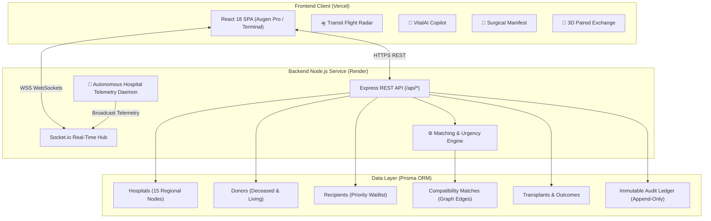
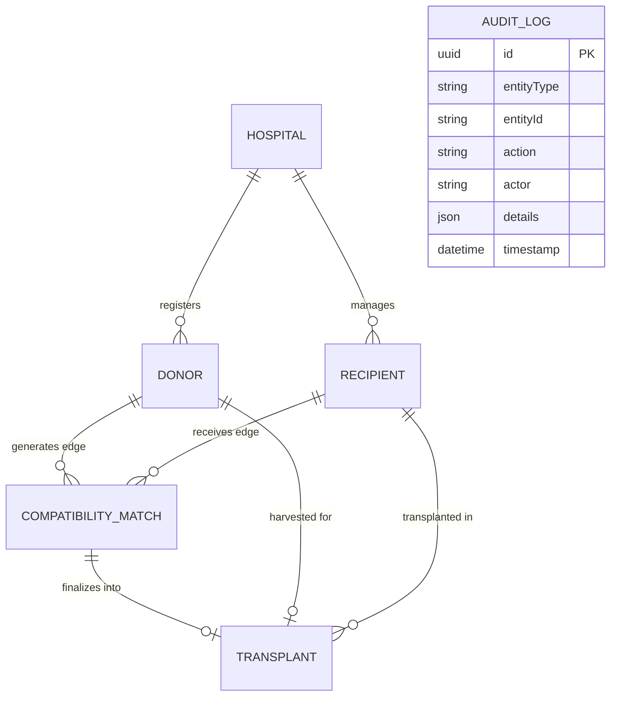

# VitalNode (ODRMN) — Autonomous Organ Allocation & Regional Medical Logistics Network

<div align="center">


### *Precision Clinical Allocation • Real-Time ADS-B Organ Transit Radar • Explainable Copilot AI • ACID Multi-Hospital Consensus*

[](https://vital-node-organ-allocation.vercel.app)
[](https://vital-node-organ-allocation.onrender.com)
[](LICENSE)
[](https://nodejs.org)
[](https://react.dev)
[](https://prisma.io)

---

### 🌐 Live Production Deployments

| Component | Platform | Live URL |
| :--- | :--- | :--- |
| **Frontend Command Terminal** | **Vercel** | **[https://vital-node-organ-allocation.vercel.app](https://vital-node-organ-allocation.vercel.app)** |
| **Backend REST & WebSockets** | **Render** | **[https://vital-node-organ-allocation.onrender.com](https://vital-node-organ-allocation.onrender.com)** |
| **Live Health Probe** | **Render** | **[https://vital-node-organ-allocation.onrender.com/api/health](https://vital-node-organ-allocation.onrender.com/api/health)** |

---

</div>

## 💡 The Human Problem: Why VitalNode Exists

In modern medicine, organ transplantation remains a miracle hindered by archaic logistics. When a donor organ becomes viable, seconds dictate survival:
- **Cold Ischemic Time (CIT)** degrades graft viability by the minute (hearts degrade within 4 hours, livers in 12 hours, kidneys in 24 hours).
- Coordinators across regional hospitals historically rely on fragmented phone calls, manual spreadsheets, and opaque priority rankings.
- Catastrophic **double-allocation race conditions** and informal triage create distrust and tragic delays.

**VitalNode** reimagines organ allocation as a unified, transparent, mathematically verifiable platform. It unites **15 regional medical centers** under atomic ACID transactional guarantees, real-time ADS-B flight corridor tracking, multi-locus HLA tissue typing, and explainable clinical AI to eliminate bureaucratic friction and maximize lives saved.

---

## ⚡ Key Highlights & Core Features

### 1. 🛸 Live ADS-B Organ Transit Radar & Medevac Flight Corridor
- **Real-Time 360° Tactical Radar**: Tracks airborne Medevac flights (*King Air 350*, *Sikorsky S-76C+*) and high-speed emergency ground couriers across regional airspace.
- **Cold Ischemia Time (CIT) Telemetry**: Live countdown clocks displaying remaining ischemic viability before irreversible tissue necrosis.
- **Hypothermic Perfusion Telemetry**: Monitors graft core temperature (regulated strictly between $3.6^\circ\text{C} - 4.1^\circ\text{C}$) and perfusion pump arterial pressure.
- **Meteorological Squall Simulator**: Interactive weather simulation (fog, squalls, 20kt headwinds) demonstrating real-time vector re-routing and dynamic ETA calculations.

### 2. 🤖 VitalAI Clinical Decision Copilot
- **Explainable Attribution Matrix**: Answers clinical coordinator queries with deep transparent breakdowns of why one recipient was prioritized over another (e.g., HLA 35%, Urgency 30%, CIT Feasibility 20%, Accrued Waitlist 15%).
- **Ischemia Risk & Delay Simulation**: Simulates the clinical ramifications of a 2h or 4h transit delay on projected **5-year graft survival probability**.
- **Contingency Backup Triaging**: Scans regional centers in real time for immediate fallback candidates if an intraoperative crossmatch suddenly fails.
- **Persistent Conversational Memory**: Chat history stays intact across navigation drawer toggles with zero layout shifts.

### 3. 📄 Cryptographic Surgical Allocation Dossier & Chain of Custody
- **Printable UNOS / OPTN Official Manifest**: Formatted specifically for physical operating theatre hand-offs and medical transport sign-offs.
- **Cryptographic SHA-256 Ledger Seal**: Immutable cryptographic digest certifying data integrity and tamper-proof allocation logging.
- **5-Locus HLA Crossmatch Table**: Side-by-side tissue compatibility matrix comparing donor and recipient allele typing (`HLA-A`, `HLA-B`, `HLA-C`, `DRB1`, `DQB1`).
- **Cold Chain Verification**: Records cross-clamp timestamps, Donor Risk Index (DRI), and transport courier custody transfers.

### 4. 🧬 Multi-Factor Compatibility & Urgency Scoring Engine
- **Blood Group Compatibility**: Strict biological ABO/Rh filtering.
- **Jaccard Tissue Compatibility**: Mathematical scoring of shared HLA loci.
- **Proximity & Travel Matrix**: Haversine geographic transit distance and estimated CIT computation.
- **Transparent Urgency Formulation**:
  $$\text{Urgency Score} = (\text{Severity} \times 0.5) + (\text{Normalized Wait Days} \times 0.3) + (\text{Prior Failed Matches} \times 0.2)$$
  $$\text{Overall Compatibility} = \text{ABO}(40) + \text{HLA}(30) + \text{Organ}(20) + \max(0, 10 - \frac{\text{Distance}}{50})$$

### 5. 🛡️ ACID 2-Phase Commit Atomic Allocation
- Completely prevents catastrophic double-allocations via serialized transactional isolation.
- Automatically re-verifies donor availability and candidate eligibility inside an atomic transaction block:
  1. Checks and locks donor availability (`isAvailable: false`).
  2. Updates recipient status from `Waiting` to `Matched`.
  3. Finalizes the matching edge and automatically cascades rejections to competing candidates.
  4. Creates a pending transplant record and appends an immutable entry to the audit ledger.

### 6. 🌐 3D Paired Kidney Exchange Network (PKE)
- Interactive 3D force-directed graph (Three.js) resolving complex donor-recipient incompatible pairs into closed 2-way and 3-way swap cycles.
- Simultaneous surgical cross-commit verification ensuring no donor donates without their paired recipient receiving an organ.

### 7. 🎨 Augen Pro Clinical Blueprint & Terminal Dark Themes
- **Augen Pro**: Apple keynote aesthetics on surgical-white canvas, hairline wireframes, and electric signal blue (`#0071e3`).
- **Command Terminal**: Deep carbon dark mode with subtle ambient aurora mesh lighting, retro phosphor glowing metrics, and live ECG cardiogram rhythms.
- Instant theme toggle persisted via `localStorage`.

---

## 🛠️ Complete Technology Stack

### **Frontend Architecture**
- **Framework**: [React 18](https://react.dev/) + [Vite 5](https://vitejs.dev/) (lightning-fast HMR and optimized production bundles)
- **Styling**: [Tailwind CSS 3](https://tailwindcss.com/) with custom design tokens, hairline borders, and CSS containment
- **Icons**: [Lucide React](https://lucide.dev/) (200+ clean clinical and logistical icons)
- **Data Visualization**: [Recharts](https://recharts.org/) (organ supply distribution donuts, outcome curves, telemetry trends)
- **3D Graphics**: [Three.js](https://threejs.org/) (Paired Kidney Exchange topology)
- **Real-Time Client**: [Socket.io Client](https://socket.io/) (persistent WebSocket connection to regional cluster)
- **UI Animation Engineering (React Bits)**:
  - `LiquidChrome`: GPU shader effects
  - `DecryptedText`: Cipher matrix text reveal
  - `Particles` & `ClickSpark`: Interactive physics bio-dust and click sparks
  - `BlinkingSquares`: Dynamic procedural instrumentation grid
  - `ShinyText`: Apple-style sweeping text gradients

### **Backend Architecture**
- **Runtime**: [Node.js](https://nodejs.org/) (v18+)
- **Framework**: [Express.js](https://expressjs.com/) (RESTful endpoints and static asset serving)
- **Real-Time Daemon**: [Socket.io](https://socket.io/) (autonomous event broadcast engine simulating donor declarations, meteorological alerts, and regional escalations every 20 seconds)
- **Database ORM**: [Prisma ORM 5](https://www.prisma.io/)
- **Database Engine**:
  - **Development / Single Instance**: SQLite (`odrmn.db`)
  - **Production Enterprise**: PostgreSQL (swappable with one line in `schema.prisma`)
- **Security & Validation**: `bcryptjs`, `jsonwebtoken`, `cors`, `express-validator`

---

## 📐 System Architecture & Data Flow



---

## 🗄️ Relational & Graph Data Model (3NF)



---

## 🚀 Local Development Setup

### 1. Prerequisites
- **Node.js** ≥ 18.x
- **npm** ≥ 9.x
- **Git**

### 2. Clone Repository
```bash
git clone https://github.com/gamerboyadarsh-dot/Vital-Node-Organ-Allocation.git
cd Vital-Node-Organ-Allocation
```

### 3. Install Dependencies
```bash
npm install
npm --prefix backend install
npm --prefix frontend install
```

### 4. Database Setup & Seeding
```bash
cd backend
npx prisma generate
npx prisma db push
node prisma/seed.js
cd ..
```

### 5. Launch Full-Stack Development Servers
```bash
npm run dev
```
- **Frontend Command Terminal**: `http://localhost:5174` (or `5173`)
- **Backend API & WebSockets**: `http://localhost:3001`

---

## 🐳 Docker Deployment

To build and run the entire full-stack application as a single containerized image:

```bash
docker compose up --build -d
```
Access the application immediately at `http://localhost:3001`.

---

## 🔒 Security, Compliance & Ethical Guarantees

- **Transparent Allocation Auditability**: Every prioritization metric, match score, and rejection reason is logged with actor attribution in the immutable audit ledger.
- **Zero Opaque Biases**: Allocation formulas are mathematical and deterministic, adhering strictly to clinical severity, tissue compatibility, and logistical Cold Ischemic Time thresholds.
- **Data Privacy**: Tissue markers and patient medical identifiers are safeguarded with strict role-based access controls (`Coordinator`, `Admin`, `Hospital Staff`).

---

## 👨‍💻 Author & Contributions

**Developed by Adarsh Agrawal**
- GitHub: [@gamerboyadarsh-dot](https://github.com/gamerboyadarsh-dot)
- Email: [gamerboyadarsh@gmail.com](mailto:gamerboyadarsh@gmail.com)

---

<div align="center">
  <sub>Built with clinical precision for life-saving organ allocation logistics.</sub>
</div>
